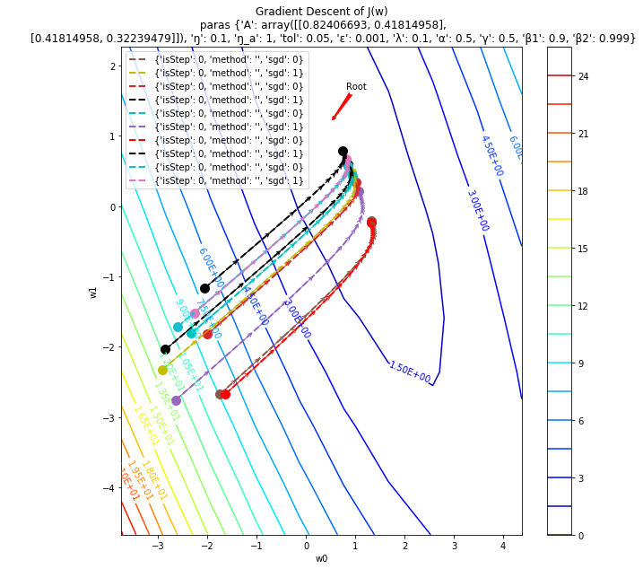
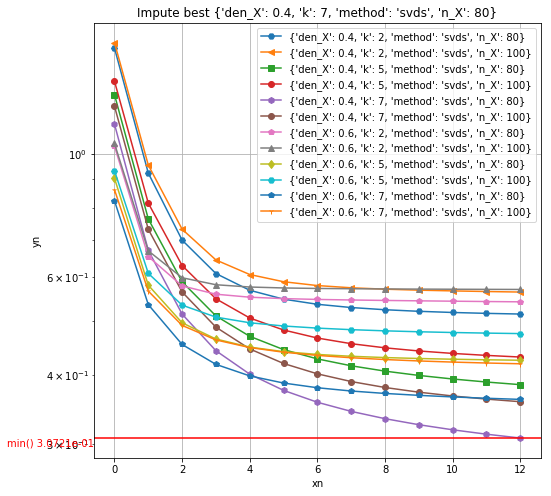
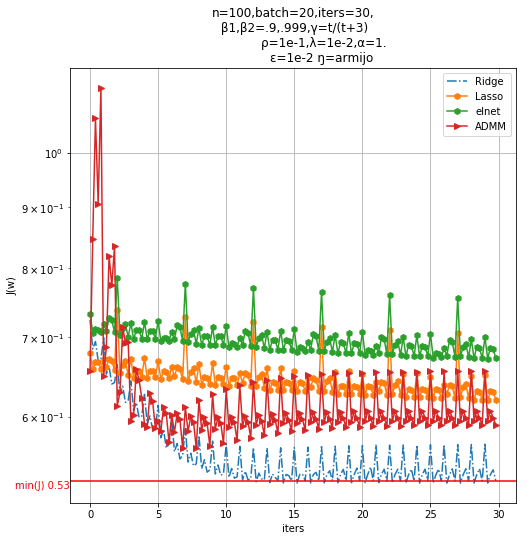
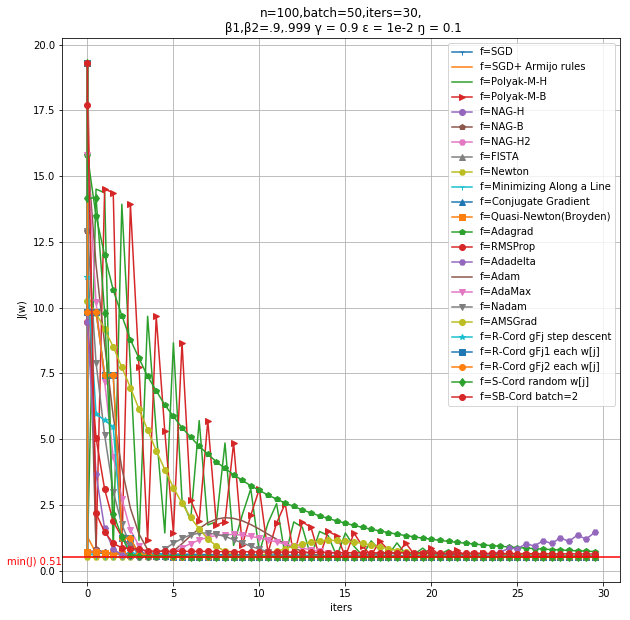
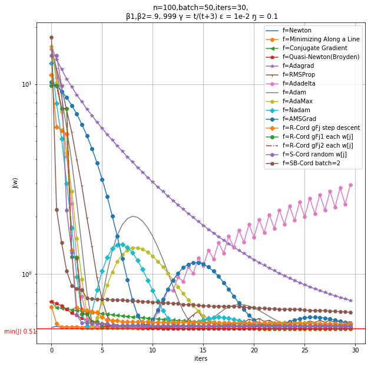
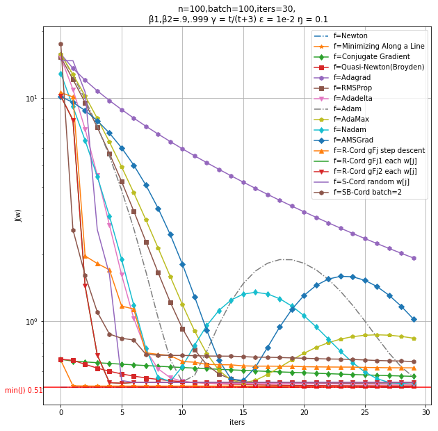

# 梯度下降优化算法

a python script of a function summarize some popular methods about gradient descent  
一个python数值模拟脚本,包含诸多概念和算法  
监督学习目标函数：线性回归,普通最小二乘OLS,二次型函数,闭式解和梯度解  
非监督学习目标函数：矩阵近似, 矩阵分解, 分数推荐  
机器学习、函数逼近模型和凸优化求解的练手项目  
Python编写和使用简明的数学符号  

## Updated  

【2019-8-30】  
添加contour轮廓线  


【2019-5-6】  
矩阵分解和推荐系统等内容
下图展示非约束矩阵分解的矩阵填充 [参考softImpute_R_code](https://github.com/cran/softImpute/blob/master/R/simpute.svd.R)  
n_X是方阵大小, den_X是稀疏密度0~1，k值是选取多少个svd变量，称截取svd
x坐标是迭代次数，y坐标是目标函数(矩阵F范数)


【2019-4-25】  
添加约束优化L1L2等内容  


## Features

- [x] 一阶优化(非约束)
	- 原版
		- GD/SGD/minibatch-GD 全批/随机/小批梯度下降 mm10
	- 带动量
		- Polyak’s 动量 mm21,mm22
		- Nesterov 加速梯度 (NAG) ,mm23,mm24,mm25
- [x] 二阶优化
	- 牛顿法 mm30
	- 沿直线最小化 mm31
	- 共轭梯度法 mm32
	- 拟牛顿法Quasi-Newton(Broyden) mm33
- [x] 非凸优化
	- Adagrad(自适应梯度) mm40
	- RMSProp mm41
	- Adadelta mm42
	- Adam mm43
	- AdaMax mm44
	- Nadam mm45
	- AMSGrad mm46
- [x] 坐标下降
	- 循环坐标逐步(闭式解) mm90,mm91
	- 随机坐标下降 mm92
	- 循环块坐标 mm93
	- 随机块坐标 mm94
- [x] 速率(学习率)
	- Armijo rules 
- [x] 约束优化
	- L0(Best subset selection)
		- 向前逐步回归(匹配追踪)
	- L1(Lasso) 
		- 软阈值坐标下降,近端梯度(广义梯度) mm52
		- 对偶ADMM mm54
		- FISTA (NAG 近端梯度版) mm26
	- L2(岭回归) mm51
	- L2(组Lasso)
	- L1+L2(弹性网) mm53
	- L1+L2(稀疏组Lasso)
- [x] 矩阵相关
	- [x]矩阵填充(分解)
		- 稀疏矩阵近似 ∥∥Z^∥∥l1 ≤ c
		- 奇异值分解 rank(Z^) ≤ c
		- 原子范数约束  ∥∥Z^∥∥⋆ ≤ c
		- 惩罚SVD Z^=UDVT,ϕ1(uj)≤c1,ϕ2(vk)≤c2
- [ ] 非凸约束
	- 自适应Lasso

## Usage

spyder下直接块运行
或者py xxx.py

Sample:  




矩阵近似(填充)的推荐系统:  

```python
===svd aproxi===  
====r= 2 =====  

 0.47 %  
 0.94 %  
1 : obj= 0.04616 ratio= 0.7232133195138838  
[[ 0.865  0.016  0.175    nan    nan]  
 [-0.6      nan -0.212    nan    nan]  
 [-0.717    nan    nan  0.064 -0.098]  
 [ 0.697 -0.503  0.558  1.544    nan]  
 [ 1.231 -0.342 -0.81  -0.82  -0.133]  
 [ 0.266  0.145    nan    nan -2.241]]  

 [[ 8.655e-01  1.565e-02  1.748e-01  1.223e-03 -2.939e-02]  
 [-6.004e-01 -1.474e-01 -2.119e-01 -3.598e-02  1.956e-02]  
 [-7.169e-01 -1.224e-01  2.289e-02  6.437e-02 -9.754e-02]  
 [ 6.966e-01 -5.033e-01  5.585e-01  1.544e+00 -2.776e-01]  
 [ 1.231e+00 -3.423e-01 -8.103e-01 -8.201e-01 -1.326e-01]  
 [ 2.664e-01  1.449e-01 -3.540e-02  2.657e-01 -2.241e+00]]  
```

## Reference

[The Elements of Statistical Learning 统计学习基础(配中文)](https://esl.hohoweiya.xyz)
[数据科学实战速查表](https://item.jd.com/12483083.html)
[梯度下降总结](http://ruder.io/optimizing-gradient-descent/index.html#nesterovacceleratedgradient)  
[卡内基凸优化2012秋](https://www.cs.cmu.edu/~ggordon/10725-F12/schedule.html)  
[SGD wiki](https://en.wikipedia.org/wiki/Stochastic_gradient_descent)  
[Armijo wiki](https://en.wikipedia.org/wiki/Backtracking_line_search)  
[Wolfe wiki](https://en.wikipedia.org/wiki/Wolfe_conditions)  
[Quasi-Newton wiki](https://en.wikipedia.org/wiki/Quasi-Newton_method)  
[分布式机器学习:算法、理论与实践-第4、5章](https://item.jd.com/12444377.html)  
[深度学习核心技术与实践-第6章](https://item.jd.com/12316912.html)  
[神经网络设计-第9章](hagan.okstate.edu/nnd.html)  
[statistical learning with sparsity](https://web.stanford.edu/~hastie/StatLearnSparsity_files/SLS_corrected_1.4.16.pdf)  
[稀疏统计学习及其应用[中文]](https://item.jd.com/12296738.html)
[坐标下降软阈值Lasso推导](https://stats.stackexchange.com/questions/123672/coordinate-descent-soft-thresholding-update-operator-for-lasso)  
[矩阵分析与应用-张贤达-第3、4章](https://book.douban.com/subject/1257113/)  

## Licence

[MIT Go to this](#gradient-descent-optimization)

THE END
Enjoy